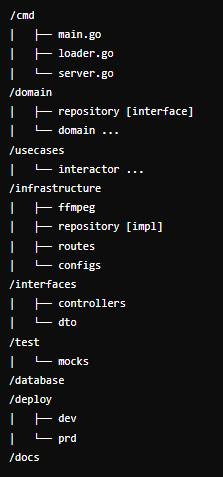
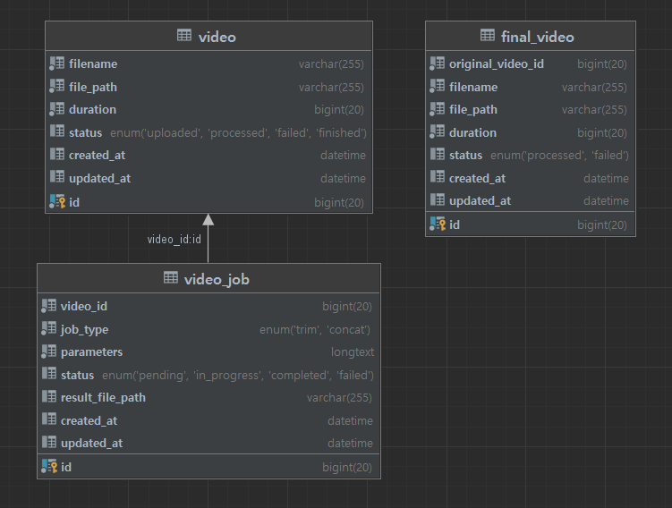

# ffmpeg-video-modules

<br>

### 핵심 문제 해결 전략 및 분석 🧐

* 📌 [FFmpeg 라이브러리로 구현하는 동영상 처리 모듈: 문제 해결 전략 및 분석](https://day-t.tistory.com/11)

<br><br>

### FFmpeg 및 FFprobe 설치 가이드 (Windows 10)

```
# 📌 FFmpeg 및 FFprobe 설치
  - [FFmpeg 다운로드 페이지](https://ffmpeg.org/download.html)로 이동
  - Windows 빌드 선택 (권장: [gyan.dev](https://www.gyan.dev/ffmpeg/builds/))
  - "Release builds"에서 `ffmpeg-release-essentials.zip` 다운로드
  - ZIP 파일을 `C:\ffmpeg`에 압축 해제


# 📌 PATH 환경 변수 추가
  - `C:\ffmpeg\bin` 경로 복사
  - 내 PC → 속성 → 고급 시스템 설정 → 환경 변수 클릭
  - 시스템 변수에서 `Path` 편집 → 새 경로에 `C:\ffmpeg\bin` 추가
  - 모든 창 닫기


# 📌 설치 확인
  - Win + R → "cmd" 입력 후 실행
  - `ffmpeg -version` 및 `ffprobe -version` 입력해 설치 확인
```

* 위 과정을 진행해야 Local 환경에서 ffmpeg 라이브러리를 사용할 수 있습니다.

<br><br>

### MariaDB 컨테이너 실행 (Windows Powershell)

```
docker network create --driver bridge mynetwork

docker network ls

docker run -d --name mariadb -p 3310:3306 -v mysql_db:/var/lib/mysql --network mynetwork -e MYSQL_DATABASE=ffmpeg-video-database -e MYSQL_ROOT_PASSWORD=password mariadb:latest
```

<br><br>

### 실행

```
# 📌 GoLand IDE에서 프로그램 실행 시 설정하는 방법

- Program arguments: Go 프로그램을 실행할 때 전달할 명령줄 인수. 
- 여기서는 `-c deploy/dev/config.toml`을 전달하여 `config.toml` 파일을 설정 파일로 사용합니다.

- 설정 방법
  1. GoLand에서 Run/Debug Configurations를 엽니다.
  2. Program arguments 필드에 `-c deploy/dev/config.toml`을 입력합니다.
  3. 이 설정은 프로그램이 `config.toml` 파일을 읽어들이도록 하여, 지정된 환경 설정을 로드하게 합니다.
  4. 설정을 저장하고, Run 버튼을 클릭하여 프로그램을 실행합니다.

```

<br><br>

### 테스트 코드 실행 시키기 (Git Bash)

```
# 📌 모든 테스트 코드 실행
go test ./cmd/...


# 📌 커버리지 프로파일 생성 후, HTML 보고서 생성
go test -v -coverprofile=coverage.out ./cmd/...
go tool cover -html=coverage.out
```

<br><br>

### 헬스 체크 API 테스트 (Git Bash)

```git bash
$ curl --http1.1 http://localhost:3031/api/health
```

<br><br>

### 테스트 비디오 생성 ffmpeg 명령어 (Windows Powershell)

```
ffmpeg -f lavfi -i color=c=blue:s=320x240:d=5 -vf "drawtext=fontfile='C\\Windows\\Fonts\\arial.ttf': text='Test Video 1': fontcolor=white: fontsize=24: x=(w-text_w)/2: y=(h-text_h)/2" -c:v libx264 -t 5 -pix_fmt yuv420p "C:\test_video_1.mp4"

ffmpeg -f lavfi -i color=c=red:s=320x240:d=6 -vf "drawtext=fontfile='C\\Windows\\Fonts\\arial.ttf': text='Test Video 2': fontcolor=white: fontsize=24: x=(w-text_w)/2: y=(h-text_h)/2" -c:v libx264 -t 6 -pix_fmt yuv420p "C:\test_video_2.mp4"

ffmpeg -f lavfi -i color=c=green:s=320x240:d=7 -vf "drawtext=fontfile='C\\Windows\\Fonts\\arial.ttf': text='Test Video 3': fontcolor=white: fontsize=24: x=(w-text_w)/2: y=(h-text_h)/2" -c:v libx264 -t 7 -pix_fmt yuv420p "C:\test_video_3.mp4"

ffmpeg -f lavfi -i color=c=yellow:s=320x240:d=5 -vf "drawtext=fontfile='C\\Windows\\Fonts\\arial.ttf': text='Test Video 4': fontcolor=black: fontsize=24: x=(w-text_w)/2: y=(h-text_h)/2" -c:v libx264 -t 5 -pix_fmt yuv420p "C:\test_video_4.mp4"

ffmpeg -f lavfi -i color=c=purple:s=320x240:d=6 -vf "drawtext=fontfile='C\\Windows\\Fonts\\arial.ttf': text='Test Video 5': fontcolor=white: fontsize=24: x=(w-text_w)/2: y=(h-text_h)/2" -c:v libx264 -t 6 -pix_fmt yuv420p "C:\test_video_5.mp4"
```
* 위 명령어를 실행하면, 테스트 비디오 파일들은 `C 드라이브`의 루트에 생성됩니다.

<br><br>

### Swagger 테스트 (사용 예시)

(... 작성 중 ...)

<br><br>

### Application Server Architecture


📌 [참고 Link](https://github.com/bxcodec/go-clean-arch)

<br><br>

### Go Clean Architecture 기반 폴더 구조



<br><br>

### ERD(Entity Relationship Diagram)



<br><br>

### API Endpoint

| HTTP Method | URI                       | Description              |
|-------------|---------------------------|--------------------------|
| `POST`      | `/api/videos`               | 동영상 업로드                  |
| `POST`      | `/api/videos/{id}/trim`     | `명령` 동영상 컷 편집 (Trim)     |
| `POST`      | `/api/videos/concat`        | `명령` 동영상 이어 붙이기 (Concat) |
| `POST`      | `/api/jobs/execute`         | `명령` 작업 수행                 |
| `GET`       | `/api/videos/{id}/download` | 최종 동영상 다운로드              |
| `GET`       | `/api/videos`               | 동영상 및 작업 조회              |

<br><br>

### Git 커밋 메시지 규칙

| Tag        | Description                                         |
|------------|-----------------------------------------------------|
| `feat`     | 새로운 기능을 추가한 경우 사용합니다.                               |
| `fix`      | 버그를 수정한 경우 사용합니다.                                   |
| `refactor` | 코드 리팩토링한 경우 사용합니다.                                  |
| `style`    | 코드 형식, 정렬, 주석 등의 변경(동작에 영향을 주는 코드 변경 없음)한 경우 사용합니다. |
| `test`     | 테스트 추가, 테스트 리팩토링(제품 코드 수정 없음, 테스트 코드에 관련된 모든 변경에 해당)한 경우 사용합니다.                                             |
| `docs`     | 문서를 수정(제품 코드 수정 없음)한 경우 사용합니다.                                             |
| `chore`    | 빌드 업무 수정, 패키지 매니저 설정 등 위에 해당되지 않는 모든 변경(제품 코드 수정 없음)일 경우 사용합니다.                                             |

<br><br>
